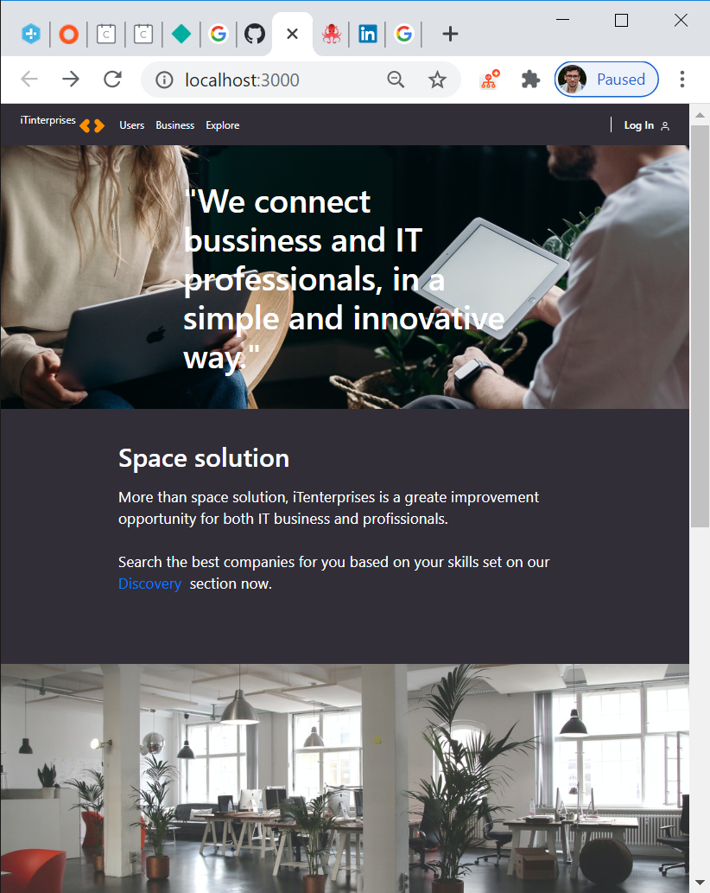
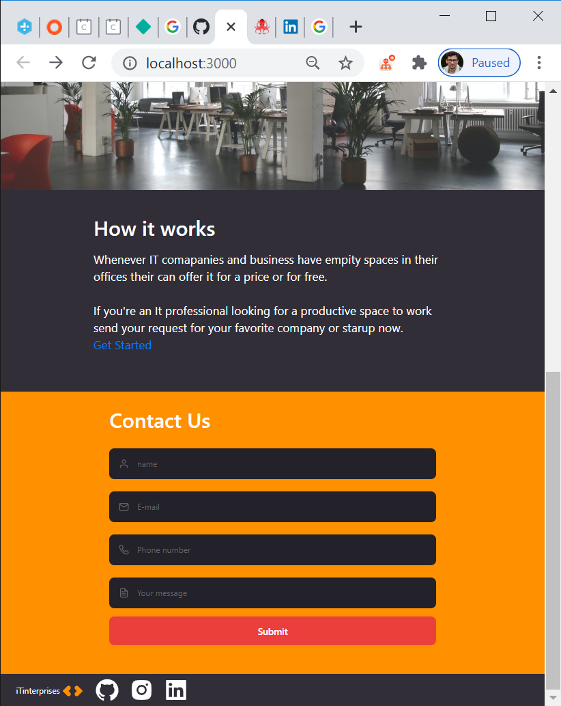
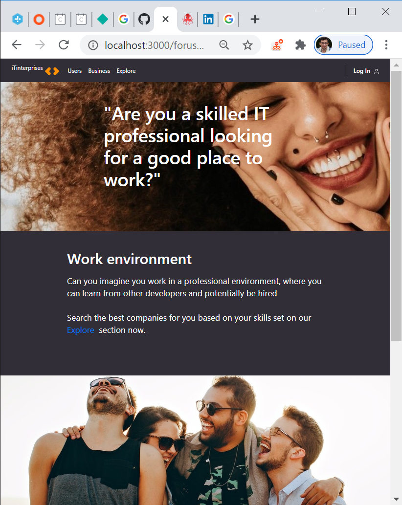
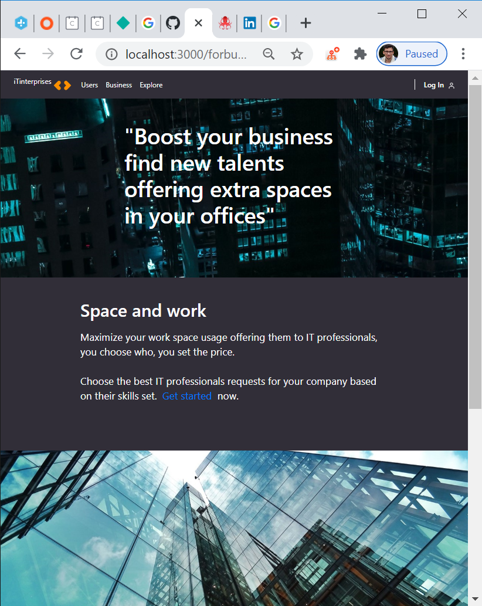
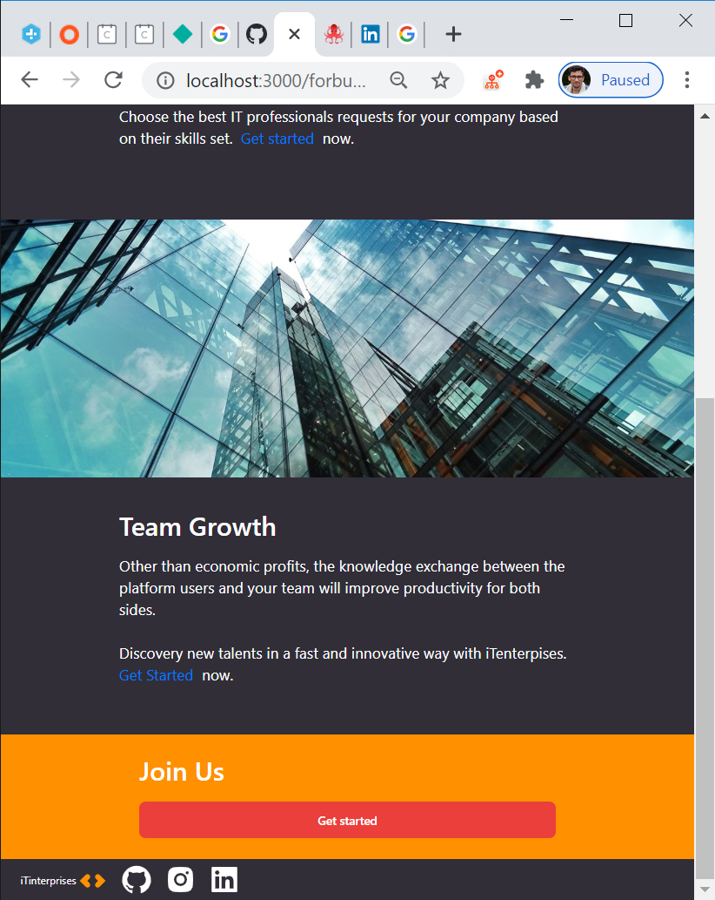
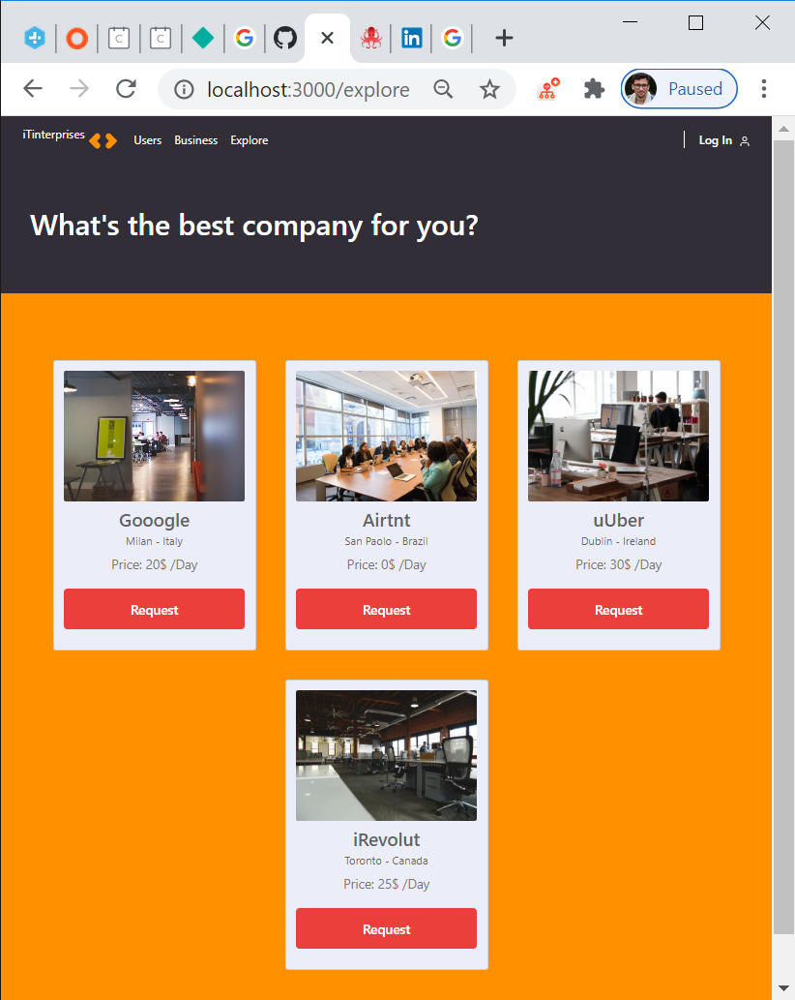
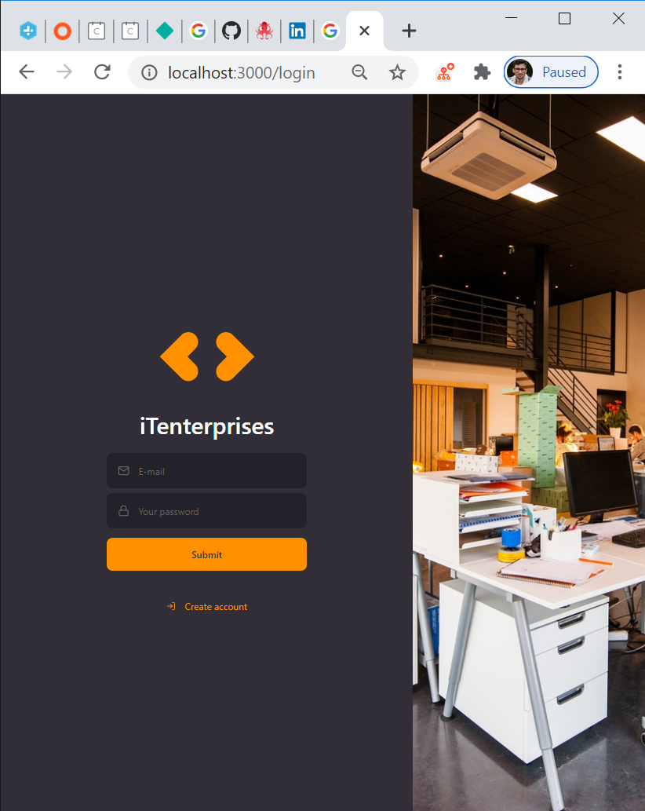
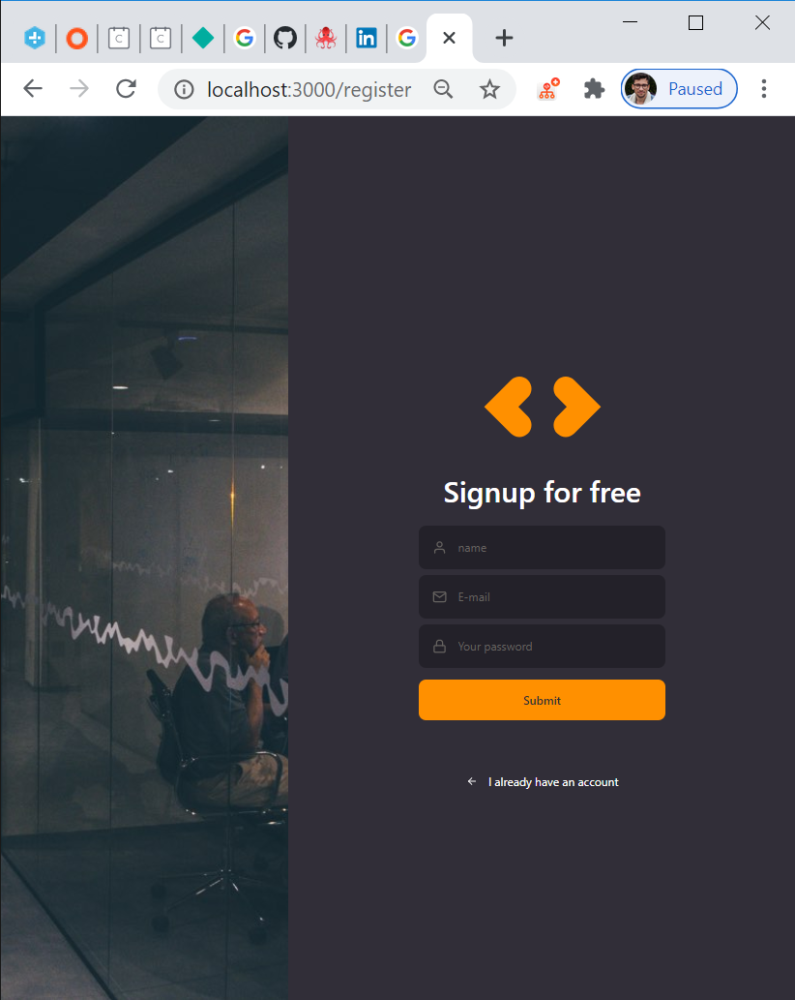

# iTenterprises  

The app connects IT professionals looking for a great place to work, to companies 
that are offering free spots in their companies and their set the prices.

  

 
## UX
 
  The App consists in a `main` page where useres can have an Overview whats the plataform 
  about, with a responsive layout a contact us form for more info, a footer with my social medias and 
  a navbar where you can navigate in the website.

  From the navbar you can access The `users` and `business` section, wich are pretty much the same layout
  but diferent media and text content and a get started button. the `explore` section consists in a static
  list of companies that users can send their requests.

  The `login` and `register` page, all elements are made with all best pratices of HTML and it's proops, 
  CSS flex box animations, and design patterns aiming better code manteinence and growth.

## Features

- Login page "/login" - The page consists in 2 inputs email, password and a button submit bellow a link pointing to 
the register section if user don't have an account.

- Register page "/register" The page consists in 3 inputs email, password, confirm password and a button submit 
bellow a link pointing to the Login section if user already have an account.

- Main Page "/" The page consists in an overview of iTenterprises, how it works with a contact form bellow
for more info.

- Users page "/forusers" The page consists sections in "Advantages of being a user of the plataform" with a 
get started.

- Companies page "/forcompanies" The page consists in sections "Advantages of being a company using the plataform" 
with a get started.

- Explore page "/explore" The page consists in a static responsive card list with the companies users can apply for.

- Components. The app is separated in isolated components that can be used in all app such as navbar, footer, 
cards and input.

   Warning: The App is Entirely static but all the functions can be implemented at any time.
   

## Media

## Technologies 

- [Yarn](https://yarnpkg.com/pt-BR/docs/install)

- 📗 **ReactJs** — A JavaScript library for building user interfaces
- 📕 **styled-components** — Library transforms css in Components.
- 📙 **react-icons** — SVG React icons of popular icon packs using ES6 imports.
- 📒 **react-router-dom** — Library allows easy navigation in the app.
- 📘 **polished** - A lightweight toolset for writing styles in JavaScript.
- ✔️ **Yup** — Javascript schema validation library.
- ✅ **Lint** — ESlint/Prettier/Editor Config. 
- ☑️ **Typescrit** — TypeScript is a typed superset of JavaScript that compiles to plain JavaScript. 
- 🔡 **Unform** — Easy peasy highly scalable ReactJS & React Native forms. 
- 🔡 **Jest** — JavaScript Testing Framework. 

## Testing

    **All components in the app are tested in unit tests using jest**
    1. Go in the project folder and run: `yarn test` or `npm test` in your terminal.
      -   Input element.
          √ should be able to render an input
              √ should be able to render an input
      -   Button element
          √ should be able to render button 
      -   Card element
          √ should be able to render cards
      -   Navbar component
          √ should be able to render navbar correctly
      -   Footer component
          √ should be able to render footer correctly 
       
   
   <pre>
   Route Links in the app are mocked too.
   
   All <a> are workng.
  
   I tested the app manually on a variaty of browsers:
   
   Chrome
   Brave
   Edge
   FireFox
   
   Using the inspector I tested responsivity in variety of screen sizes.
   
There are `console.log()`s as a test if the information has been sent or not in the forms.
a validation returns the information and the possible errors.
   </pre>

Forms:
  1. Go to "/", "/register" or "/login" pages, right click and inspect and sonsole.
  2. Try to submit the empty form and verify that an error mes
  sage about the required fields 
  appears in the console and input.
  3. Try to submit the form with an invalid email address and verify that a relevant error 
  message appears in the console and input.
  4. Try to submit the form with all inputs valid and verify that a no errors message appears 
  in your console and input.
    
    *** Warning Logs shoulden't be used in production as they can return confidential data. ***
    
## Structure

<pre>
 Inside `src` folder you will find the all source code, with the respective folders representing the
 component or the page in the App.
 each folder has a index_file with the HTML code source.
 and a styles_file with al the CSS code source.

EX:
  src_folder
    signin_folder
      index_file
      styles_file
    signup_folder
      index_file
      styles_file
       
 as I'm using the lib styled components, I'm importing the css to index_file rendered in html tags <> as a component.
 
 EX: 
 
 import { Container } from './styles';

  <Container>
    < h1 > {CSS from './styles' applied here} < /h1 >
  </Container>
      </pre>

    
## Deployment
  
  The website is running deployed on Netlify:
  https://inspiring-wing-60e4c6.netlify.app/
  
## Get Started.

<h4>Required*<h4/>
  <h5>* Npm or Yarn<h5/>
    <ul>
      <li>`$ git clone` This project in your local repository. 
      <li>`$ cd` The project in your editor.
      <li>Run `$ npm instal` or `$ yarn` in your terminal.
      <li>Run `$ npm instal` or `$ yarn`
      <li>Done. the project is running on your localhost.
    <ul/>
        
          
### Media
- The photos used in this site were obtained from:
  https://www.pexels.com/
  
  App View Screenshots.
  
          

### Acknowledgements

- I received inspiration for this project from:
  https://www.wework.com/enterprise
  https://codeinstitute.net/
  https://www.airbnb.ie/
  https://rocketseat.com.br/
  
  
## License

This project is licensed under the MIT License - see the [LICENSE.md](LICENSE.md) file for details. .❤❤❤

